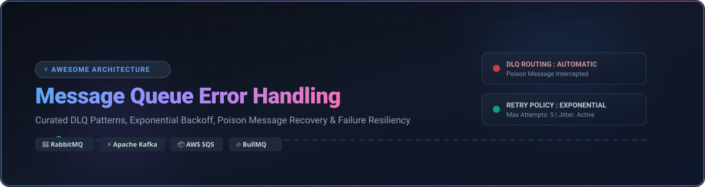

# ⚡ Awesome Message Queue Error Handling 🚀

<p align="center">
  <a href="https://github.com/ishandutta2007/Awesome-Awesome-Awesome"></a><a href="https://discord.gg/jc4xtF58Ve"></a>   <a href="https://github.com/ishandutta2007"></a>
</p>

<p align="center">
  
</p>

## 📌 Top Message Queue Error Handling Ecosystem

**A Curated List of Managed SaaS Platforms & Open-Source GitHub Projects**  
*Focused on Dead Letter Queues (DLQ), Exponential Backoff Retry Patterns, Poison Message Recovery & Self-Hosted Resilience*  

📅 **Last updated: October 2026**

---

### 💡 Overview & SEO Keywords
This repository tracks notable **commercial managed services and open-source message queue platforms** that provide robust error handling capabilities — including dead letter queues (DLQ), retry logic with backoff & jitter, poison message detection, circuit breaking, and event replay — to eliminate message loss and ensure production-grade reliability in distributed systems and microservices.

---

## 📑 Table of Contents

- [🌐 Market Overview & Insights](#-market-overview--insights)
- [☁️ SaaS / Managed Platforms](#️-saas--managed-platforms)
- [📦 Open-Source GitHub Projects](#-open-source-github-projects)
- [⚙️ Error Handling Architecture Best Practices](#️-error-handling-architecture-best-practices)
- [🤝 How to Contribute](#-how-to-contribute)
- [💖 Support & Community](#-support--community)
- [📈 Star History](#-star-history)
- [⚠️ Disclaimer](#️-disclaimer)

---

## 🌐 Market Overview & Insights

> 📊 **Estimated Market Size & Industry Dynamics**:  
> The global **Message Queue & Event Streaming Infrastructure Market** is estimated at **~$15.8 Billion in 2026** and projected to grow to over **$32 Billion by 2030** (CAGR ~18.5%). The sector is **moderately fragmented**: major hyperscalers (AWS SQS/EventBridge, Azure Service Bus, GCP Pub/Sub) dominate the managed enterprise cloud segment (>60% share), while open-source ecosystems (Apache Kafka, RabbitMQ, NATS, Celery) maintain massive developer mindshare and self-hosted dominance.

---

## ☁️ SaaS / Managed Platforms

Below is a curated comparison of leading managed messaging platforms sorted by **Company Valuation / Revenue Size (Descending)**.

| 🏢 Platform / Service | 💰 Company Valuation / Revenue Size | 💵 Specific Pricing (Starting Tier) | 🎁 Free Tier Limit / Trial | 🛠️ Key Error Handling Features & Best For |
| :--- | :--- | :--- | :--- | :--- |
| **[Azure Service Bus](https://azure.microsoft.com/en-us/products/service-bus/)** 🔷 | **~$3.1 Trillion** (Microsoft Market Cap) | **$0.05 per 1M operations** (Standard tier base $10/mo) | **750 hours + $200 credit** (Azure 30-day trial & 12 mo free services) | Automatic dead-lettering for expired messages, max delivery count triggers, sub-queue filtering. *Best for Azure enterprise microservices.* |
| **[AWS SQS & EventBridge](https://aws.amazon.com/sqs/)** 🟧 | **~$2.1 Trillion** (Amazon Market Cap / AWS $100B+ Rev) | **$0.40 per 1M requests** (Standard) / $0.50 per 1M (FIFO) | **1,000,000 SQS requests/month** (Forever Free Tier) | Configurable `maxReceiveCount`, automated redrive policies, DLQ target queues, EventBridge retries. *Best for AWS-native event routing.* |
| **[Google Cloud Pub/Sub](https://cloud.google.com/pubsub)** 🟦 | **~$2.0 Trillion** (Alphabet Market Cap) | **$40.00 per TiB** (~$0.04 per GB throughput) | **10 GiB throughput/month** (Forever Free Tier) | Dead letter topics with configurable max delivery attempts, exponential retry backoff. *Best for GCP real-time pipelines.* |
| **[IBM MQ Cloud](https://www.ibm.com/products/mq)** 🏢 | **~$210 Billion** (IBM Market Cap) | **$0.70 per hour** (~$510/month reserved cloud deployment) | **30-Day Free Trial** ($200 IBM Cloud credits included) | Enterprise backout queues, poison message detection, transaction rollbacks. *Best for financial & enterprise legacy integrations.* |
| **[Confluent Cloud](https://www.confluent.io/)** ⚡ | **~$8.5 Billion** (Confluent Market Cap) | **$0.00/hr cluster base** + $0.10/GB ingested (Basic Serverless) | **$400 Free Credits** valid for 30 days upon sign-up | Serverless Kafka Connect DLQ routing, Schema Registry error handling, stream lineage tracking. *Best for enterprise Kafka event streaming.* |
| **[Upstash QStash](https://upstash.com/docs/qstash)** 🚀 | **~$50 Million** (Series A Valuation) | **$0.20 per 100K messages** ($10/mo capped plan) | **500 requests/day** (15,000 requests/month Forever Free) | HTTP-based message queuing, automatic retries with exponential backoff, DLQ webhook endpoints. *Best for serverless & edge functions (Vercel/Next.js).* |

---

## 📦 Open-Source GitHub Projects

Sorted strictly by **GitHub Stars_Count (Descending)**. Stars_Badges link directly to the stargazers page of each repository.

| 🐙 Project | ⭐ Stars_Count | 📜 License | 🛠️ DLQ & Error Handling Features | 🎯 Best Used For |
| :--- | :--- | :--- | :--- | :--- |
| **[Apache Kafka](https://github.com/apache/kafka)** 🐘 | [](https://github.com/apache/kafka/stargazers) | Apache-2.0 | DLQ sink connectors via Kafka Connect, offset commit management, deserialization exception handlers. | High-throughput event streaming & log processing |
| **[Celery](https://github.com/celery/celery)** 🥬 | [](https://github.com/celery/celery/stargazers) | BSD-3-Clause | `retry()` with exponential backoff, `max_retries`, task reject on worker loss, custom failure callbacks. | Python distributed task execution |
| **[Temporal](https://github.com/temporalio/temporal)** ⏳ | [](https://github.com/temporalio/temporal/stargazers) | MIT | Durable execution, automatic stateful retries, saga pattern compensation, zero-message-loss workflow engines. | Complex multi-step business orchestrations |
| **[NATS Server](https://github.com/nats-io/nats-server)** ⚡ | [](https://github.com/nats-io/nats-server/stargazers) | Apache-2.0 | JetStream redelivery limits, max payload error limits, dead letter subject routing. | Lightweight cloud-native pub/sub & microservices |
| **[Apache Pulsar](https://github.com/apache/pulsar)** 🌌 | [](https://github.com/apache/pulsar/stargazers) | Apache-2.0 | Negative acknowledgment (nack), built-in Dead Letter Topic (DLT) & Retry Letter Topic policies. | Multi-tenant unified messaging & streaming |
| **[Sidekiq](https://github.com/sidekiq/sidekiq)** 💎 | [](https://github.com/sidekiq/sidekiq/stargazers) | LGPL-3.0 | Automatic exponential retry backoff, DeadSet queue after max retries for manual inspection. | Ruby on Rails background job processing |
| **[RabbitMQ Server](https://github.com/rabbitmq/rabbitmq-server)** 🐇 | [](https://github.com/rabbitmq/rabbitmq-server/stargazers) | MPL-2.0 | Dead Letter Exchanges (DLX), Time-To-Live (TTL) per queue/message, consumer nack/reject routing. | Enterprise message queuing & routing |
| **[Resilience4j](https://github.com/resilience4j/resilience4j)** 🛡️ | [](https://github.com/resilience4j/resilience4j/stargazers) | Apache-2.0 | Retry mechanisms, Circuit Breaker, Rate Limiter, and Bulkhead wrappers for message listeners. | Java microservice fault tolerance |
| **[RQ (Redis Queue)](https://github.com/rq/rq)** 🐍 | [](https://github.com/rq/rq/stargazers) | BSD-2-Clause | Custom retry delays, explicit `FailedQueue` capture for failing jobs. | Simple Python Redis-backed task queuing |
| **[Redpanda](https://github.com/redpanda-data/redpanda)** 🐼 | [](https://github.com/redpanda-data/redpanda/stargazers) | BSL-1.1 | C++ Kafka-compatible streaming engine supporting all native Kafka DLQ & consumer offset error patterns. | High-performance JVM-free event streaming |
| **[Dapr](https://github.com/dapr/dapr)** 🧩 | [](https://github.com/dapr/dapr/stargazers) | Apache-2.0 | Resiliency specs with retry policies, circuit breakers, and dead letter topic routing for pub/sub components. | Multi-language cloud-native application runtime |
| **[MassTransit](https://github.com/MassTransit/MassTransit)** 🚆 | [](https://github.com/MassTransit/MassTransit/stargazers) | Apache-2.0 | Out-of-the-box endpoint retry policies, immediate/delayed retries, automatic `_error` and `_skipped` queues. | .NET distributed microservices messaging |
| **[BullMQ](https://github.com/taskforcesh/bullmq)** 🐂 | [](https://github.com/taskforcesh/bullmq/stargazers) | MIT | Configurable `attempts` with exponential/custom backoff strategies, automated moving to failed DLQ state. | Node.js & TypeScript Redis background jobs |
| **[Asynq](https://github.com/hibiken/asynq)** 🐹 | [](https://github.com/hibiken/asynq/stargazers) | MIT | Go Redis asynchronous task queue, automatic retries with custom delay function, archival queue after max retries. | Go asynchronous background task processing |
| **[Watermill](https://github.com/ThreeDotsLabs/watermill)** 💧 | [](https://github.com/ThreeDotsLabs/watermill/stargazers) | MIT | Go library for event-driven systems, middleware for retries, poison queue handler, and throttle management. | Go event-driven architectures & CQRS |

---

## ⚙️ Error Handling Architecture Best Practices

```
                 +-------------------+
                 | Producer Component|
                 +---------+---------+
                           |
                           v
                 +-------------------+
                 | Main Queue / Topic|
                 +---------+---------+
                           |
                           v
                 +-------------------+
                 |  Consumer Worker  |
                 +---------+---------+
                           |
           +---------------+---------------+
           | Success                       | Processing Error
           v                               v
     [ Ack & Remove ]            +-------------------+
                                 |  Retry Mechanism  |
                                 |  (Exponential)    |
                                 +---------+---------+
                                           |
                           +---------------+---------------+
                           | Retry Count < Max             | Max Retries Exceeded
                           v                               v
                   [ Requeue Message ]           +-------------------+
                                                 | Dead Letter Queue |
                                                 |     (DLQ)         |
                                                 +-------------------+
```

### 🧠 Core Architectural Rules:
1. **Dead Letter Queue (DLQ) Isolation**: Never discard failed payloads silently. Always route messages exceeding maximum retry thresholds to a segregated DLQ for manual inspection or secondary analysis.
2. **Exponential Backoff with Random Jitter**: Avoid instant retries or synchronized intervals to prevent thundering herd overload on downstream databases and APIs.
3. **Poison Message Detection**: Identify malformed JSON, unparseable schemas, or corrupt payloads early and bypass retry cycles directly to the DLQ.
4. **Idempotent Message Processing**: Guarantee that retried processing yields identical system state using unique message IDs and deduplication storage (e.g., Redis / Postgres idempotency keys).

---

## 🤝 How to Contribute

Contributions are warmly welcome! To add or update an entry:
1. **Fork** this repository.
2. Edit `README.md` maintaining table formatting, specific pricing/star metrics, and links.
3. Submit a **Pull Request** with a brief summary of additions.

Refer to the curated awesome directory list at [Awesome-Awesome-Awesome](https://github.com/ishandutta2007/Awesome-Awesome-Awesome) for complementary resources.

---

## 💖 Support & Community

Thank you for exploring this repository! If you find this curated list helpful for building resilient, fault-tolerant event-driven systems, please consider:
- ⭐ **Starring** this repository to show your support and increase visibility.
- 🔀 **Forking** & contributing new message queue tools, patterns, or best practices.
- 📢 **Sharing** with your fellow backend engineers, platform developers, and DevOps teams.

<p align="left">
  <a href="https://github.com/sponsors/ishandutta2007">
    
  </a>
</p>

---

## 📈 Star History

[](https://star-history.dera.page/#ishandutta2007/Awesome-Message-Queue-Error-Handling&type=date&legend=top-left)

---

## ⚠️ Disclaimer

- This is a **community-curated list** — not exhaustive and not an official vendor endorsement.
- Message queue configurations impact production reliability and data integrity; always validate retries, rate limits, and failure handling policies in staging environments.
- Open-source licenses (Apache-2.0, MIT, MPL-2.0, BSL-1.1) should be verified prior to enterprise deployment.
